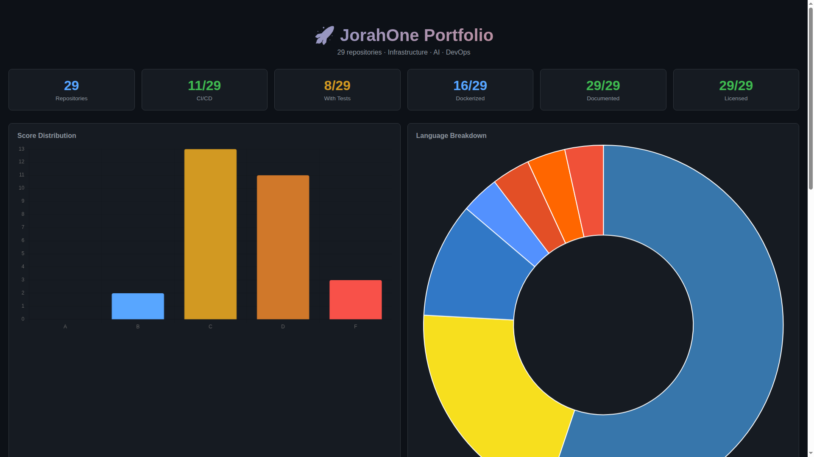

<div align="center">
  
  
  
  
  
</div>

<br>

<div align="center">
  <h1>PrimeHub</h1>
  <p><strong>JorahOne Infrastructure Portfolio Hub</strong></p>
  <p>Central dashboard for repo health, standardization status, and ecosystem overview.</p>
  <p>
    <a href="#features">Features</a> •
    <a href="#quick-start">Quick Start</a> •
    <a href="#architecture">Architecture</a> •
    <a href="#contributing">Contributing</a>
  </p>
</div>

---

## Screenshot


*Portfolio hub dashboard showing repository health and ecosystem metrics.*

## Features

- **Ecosystem Overview** — Visual dashboard of all JorahOne repositories.
- **Health Monitoring** — Real-time repo health metrics and status.
- **Standardization Tracking** — Verify README, license, and config compliance.
- **Dependency Graph** — Visualize relationships between projects.
- **Deployment Status** — CI/CD pipeline status across all repos.
- **Lightweight** — Pure HTML/CSS/JS, no build tools required.
- **GitHub API Integration** — Live data from GitHub's API.
- **Chart.js Visualizations** — Interactive charts and graphs.

## Quick Start

```bash
git clone https://github.com/OneByJorah/PrimeHub.git
cd PrimeHub

# Serve locally
python3 -m http.server 8080
# Or
npx serve .
```

Open **http://localhost:8080** in your browser.

### GitHub Token Setup

For full functionality, create a GitHub Personal Access Token:

1. Go to [GitHub Settings → Developer Settings → Tokens](https://github.com/settings/tokens)
2. Create a new token with `public_repo` scope
3. Add to your request headers or configure in `config.js`

## Configuration

| Variable | Default | Description |
|----------|---------|-------------|
| `GITHUB_ORG` | `OneByJorah` | GitHub organization to monitor |
| `REFRESH_INTERVAL` | `300000` | Data refresh interval (ms) |
| `THEME` | `dark` | UI theme (dark/light) |

## Architecture

```
Browser ──API──▶ GitHub API ──▶ PrimeHub Dashboard
                │
                ├──▶ Repo Metadata
                ├──▶ Health Metrics
                ├──▶ CI/CD Status
                └──▶ Dependency Graph
```

## Project Structure

```
PrimeHub/
├── index.html           # Main dashboard
├── css/
│   └── styles.css       # Dashboard styles
├── js/
│   ├── app.js           # Main application
│   ├── github-api.js    # GitHub API client
│   ├── charts.js        # Chart.js visualizations
│   └── config.js        # Configuration
├── assets/
│   └── images/          # Dashboard images
└── README.md
```

## Dashboard Sections

| Section | Description |
|---------|-------------|
| **Overview** | Total repos, stars, forks, issues |
| **Health** | Repo health scores and trends |
| **Standardization** | README, license, CI compliance |
| **Languages** | Language distribution across repos |
| **Activity** | Recent commits and PRs |
| **Dependencies** | Inter-project relationships |

## Contributing

Contributions are welcome. Please see [CONTRIBUTING.md](CONTRIBUTING.md) for guidelines and [CODE_OF_CONDUCT.md](CODE_OF_CONDUCT.md) for community standards.

## Security

For security concerns, see [SECURITY.md](SECURITY.md). Please report vulnerabilities to **info@jorahone.com** — do not use public issues.

## License

MIT © Jhonattan L. Jimenez

---

<div align="center">
  <p>Central hub for JorahOne infrastructure.</p>
  <p><a href="https://github.com/OneByJorah">@OneByJorah</a></p>
</div>
