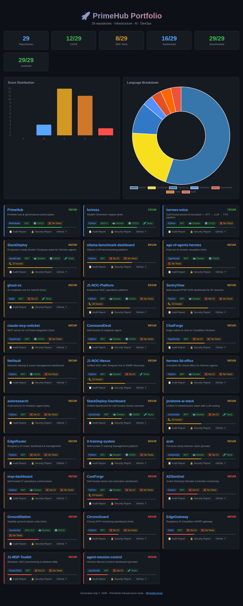

# 🔧 PrimeHub
### Live portfolio dashboard for the OneByJorah infrastructure & AI org

PrimeHub is a single-page static dashboard that catalogs the 29 open-source repositories under the OneByJorah org (JorahOne). It renders per-repo health scores, language breakdown, CI/test/Docker coverage, and links out to each project — all client-side from inline data, no backend required.



## ✨ Features
- **29-repo portfolio grid** — sortable by health score, with grade (A–F), license, and language tags
- **Live stats bar** — totals for CI/CD, tests, Docker, docs, and licensing coverage
- **Chart.js visualizations** — grade distribution (bar) and language breakdown (doughnut)
- **Zero-backend static site** — opens directly in a browser or serves from nginx
- **Docker-ready** — nginx:alpine image with healthcheck, or one-line `docker compose up`
- **Governance metadata** — `j1.yaml` carries org standards/audit info; MIT licensed, SECURITY/CONTRIBUTING/CoC included

## 🚀 Quick Start

### Docker (recommended)
```bash
docker compose up -d
# Open http://localhost:${PORT:-8080}
```

Or build/run the image directly:
```bash
docker build -t primehub .
docker run -d -p 8080:80 --name primehub primehub
# Open http://localhost:8080
```

### Manual / from source
```bash
# From the repo root, serve the static files:
python3 -m http.server 8080

# Then open:
#   http://localhost:8080/dashboard.html
```
> `dashboard.html` is the app. The Docker image copies it to `index.html` so `/` serves it directly.

## 📸 Screenshots
- **Main dashboard** — full portfolio grid with stats and charts (`docs/screenshots/main-dashboard.png`)

## 🏗️ Architecture / How It Works
- `dashboard.html` — self-contained page: HTML + CSS + vanilla JS, data inlined as a `repos` array (29 entries)
- Chart.js loaded via CDN for the two canvas charts
- `repositories.json` / `j1.yaml` — org metadata (standards, audit dates)
- `Dockerfile` — copies `dashboard.html` → `index.html` into nginx:alpine, non-root, with `HEALTHCHECK`
- `docker-compose.yml` — single `primehub` service on `${PORT:-8080}:80`

## ⚙️ Configuration
| Variable | Default | Purpose |
|----------|---------|---------|
| `PORT` | `8080` | Host port mapped to container port 80 (compose only) |

No runtime environment variables are required — `.env.example` documents this for standards compliance.

## 🧪 Testing
This is a static site with no unit-test suite. CI (`.github/workflows/ci.yml`) lints GitHub Actions with `yamllint` and enforces repo standards; it does not run app tests. Verify locally by serving and opening `dashboard.html` in a browser (29 repo cards + 2 charts should render).

## 🤝 Contributing
See [CONTRIBUTING.md](CONTRIBUTING.md). Issues and PRs welcome via the provided templates.

## 📄 License
MIT — see [LICENSE](LICENSE)

## 👤 Author
Built by **Jhonattan L. Jimenez** ([@OneByJorah](https://github.com/OneByJorah)) under **JorahOne LLC**. More projects: [github.com/OneByJorah](https://github.com/OneByJorah)
